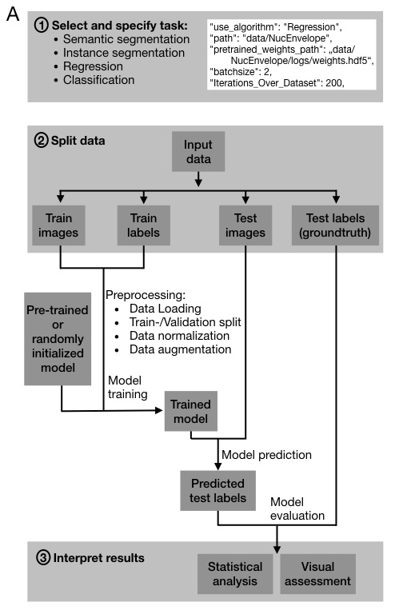
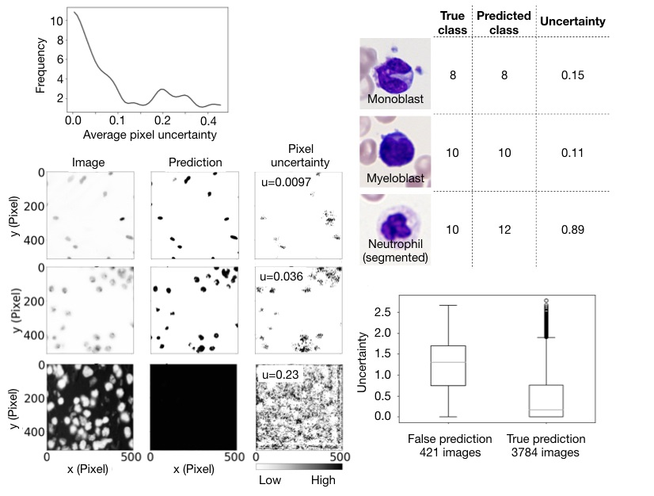

# InstandDL: An easy and convenient deep learning pipeline for image segmentation and classification

InstantDL enables experts and non-experts to use state-of-the art deep learning methods on biomedical image data. InstantDL offers the four most common tasks in medical image processing: Semantic segmentation, instance segmentation, pixel-wise regression and classification


## Installation

For installing the package, you should download the repository and run

```bash
python setup.py install
```

For running the code, you need to have Python 3.6 or higher installed. In addition, these are the main dependencies:

```yaml
- cudatoolkit: 10.1.243 # in case of GPU exastnace
- cudnn: 7.6.5 # in case of GPU exastnace
- h5py: 2.9.0
- hdf5: 1.10.4
- imageio: 2.6.1
- keras: 2.2.4
- matplotlib: 3.1.1
- numpy: 1.16.4
- python: 3.6.7
- scikit-image: 0.15.0
- scikit-learn: 0.21.3
- scipy: 1.3.0
- tensorboard: 1.14.0
- tensorflow: 1.14.0
- tensorflow-gpu: 1.14.0 # in case of GPU exastnace
- pandas: 1.0.3
```

The code automatically checks if the GPU exists. In case it won't find GPU, it will give relevant warnings and starts the calculation with CPU.

## How to use the code

There are three ways to use the code which are explained here:

### 1. With installation

In case you have installed the package, you can run the code by calling the pipeline by:

```python
from instantdl import GetPipeLine
```
The you should pass the parameters to the pipeline

```python
pipeline = GetPipeLine(use_algorithm,
                    path, 
                    pretrained_weights, 
                    batchsize, 
                    iterations_over_dataset, 
                    data_gen_args, 
                    loss_function, 
                    num_classes, 
                    image_size, 
                    calculate_uncertainty,
                    evaluation)
pipeline.run()
```
This simply runs the Deep Learning pipeline. 

### 2. Without installation

You can simply download the code. Inside the folder `instantdl`, there is a json file called `config.json` which will be used to set parameters. After this the pipeline is started by executing the main.py file, meaning:

```bash
python main.py --config ./config.json
```

Prediction from the test set will be saved after training to the Results folder which will automatically be created. 

From there evaluations using jupyter-notebooks from the Evaluation folder can be used for visual and statistical assessment. Therefore only the path in the jupyter-notebook files has to be adapted. 

### 3. Docker

For Docker installation, please refer to the [docker](docker) folder.

## Simple Example

In the following, we are trying to solve a simple MNIST classification problem with the pipeline. For simplification, we only solve a binary classification for distinguishing between `1` and `9`. First, the dataset and the groundtruth should be provided. The data folder should look like this:

```
path
├── train                    
│   ├── image
│   │    ├── 000003-num1.png
│   │    ├── 000004-num9.png
│   │    ├── 000006-num1.png
│   │    ├── .
│   │    ├── .
│   │    ├── .
│   │    └── 059994-num1.png     
│   └── groundtruth  
│        └── groundtruth.csv
│
└── test                    
   ├── image
   │    ├── 000002-num1.png
   │    ├── 000005-num1.png
   │    ├── 000007-num9.png
   │    ├── .
   │    ├── .
   │    ├── .
   │    └── 009994-num1.png     
   └── groundtruth  
        └── groundtruth.csv
```

And the `groundtruth.csv` should look like this:

| filename        |   groundtruth   |
| ------          |    ------       |
| 015312-num9.png	|        1        | 
| 012725-num1.png	|        0        |
|      . 	      |         .       |
|      . 	      |         .       |
|      . 	      |         .       |

After the data has been provided in the desired shape,, you can simply use the code with this small snippet:

```python
from instantdl import GetPipeLine

pipeline = GetPipeLine( use_algorithm = "Classification",	
                        path= "examples/Classification",
	                     pretrained_weights= "examples/data/Classification/logs/pretrained_weights_Classification.hdf5",
                        batchsize= 2,
                        iterations_over_dataset= 0,
                        data_gen_args= {
                              "save_augmented_images": False,
                              "resample_images": False,
                              "std_normalization": False,
                              "feature_scaling": False,
                              "horizontal_flip": False,
                              "vertical_flip": False,
                              "poission_noise": 1,
                              "rotation_range": 20,
                              "zoom_range": False,
                              "contrast_range": 1,
                              "brightness_range": 1,
                              "gamma_shift": 0,
                              "threshold_background_image": False,
                              "threshold_background_groundtruth": False,
                              "binarize_mask": False
                        },
                        loss_function= "binary_crossentropy",
                        num_classes= 2,
                        image_size= None,
                        calculate_uncertainty= False,
                        evaluation= True
)

pipeline.run()
```

As you can see, it is very straightforward to use the pipeline and there is no need for more programming.

## More Examples

One example of each task of semantic segmentation, instance segmentation, regression and classification is in the [docs/examples](docs/examples) folder.

## Training Parameters

Possible settings for the inputs are

- `use_algorithm`: You can choose between "Regression", "SemanticSegmentation", "Instance Segmentation" or "Classification"
- `path`: the path to your project directory here
- `use_pretrained_weights`:  Set to `True` if you want to use pretrained weights
- `pretrained_weights_path`: Set a relative file path from your project directory with the filename here
- `batchsize`:   Set the batchsize depeding on your GPU capabilities
- `iterations_over_dataset`:  Set how many iterations over the dataset should be taken for learning. It might stop automatically if no improvement on the validation set was measured after 25 epochs
- `data_gen_args` : a dictionary including these parameters:
   -  `save_augmented_images`:  false, # true or false
   -  `resample_images`:  false, # true or false
   -  `std_normalization`:  false, # true or false
   -  `feature_scaling`:  false, # true or false
   -  `horizontal_flip`:  false, # true or false
   -  `vertical_flip`:  false, # true or false
   -  `poission_noise`:  false, # false or float 
   -  `rotation_range`:  false, # false or float (degrees)
   -  `zoom_range`:  false, # false or float (magnification)
   -  `contrast_range`:  false, # false or float 
   -  `brightness_range`:  false, # false or float 
   -  `gamma_shift`:  false, # false or float (gamma shift parameter)
   -  `threshold_background_image`:  false, # true or false
   -  `threshold_background_groundtruth`:  false, # true or false
   -  `gaussian_blur_image`:  false, # true or float
   -  `gaussian_blur_label`:  false, # true or  # true or false
   -  `binarize_mask`:  false # true or false
- `loss_function`:   MSE, MAE, dice loss, binary cross entropy, categorical cross entropy ,
- `num_classes`: Number of classes (should be 1 for binary segmenation tasks)
- `image_size`: `null` or tuple with dimensions of desired image size in format (x-dim, y-dim, (z-dim), channels)
- `calculate_uncertainty`:  false # true or false
- `evaluation`  false # true or false


you can find examples of different configs in the example folders

## Training steps:

1. Import of data in all common image file formats that are processable with scikit-image (e.g. .jpg, .tiff, .png) and .npy files.
2. Initialization of a model with pre-trained weights or random weights. For classification and instance segmentation, InstantDL will automatically use ImageNet weights if no weights are given.
3. Split of ‘train’-folder into 80% training and 20% validation set and randomly shuffles the training data.
4. Normalization of data to the range between 0 and 1 based on the train dataset’s minimum and maximum pixel value. The data will be re-normalized when saved after testing.
5. Batch creation and data augmentation on the fly.
6. Training for the set epoch length using early stopping of training if the validation accuracy has not improved for the last epochs. Using the Adam optimizer (Kingma and Ba, 2014).
7. Real time monitoring of training with Tensorboard or terminal.
8. Saving of the best model during training.
9. Automated evaluation of the trained model on the test data and saving of predicted labels.
10. For pixel-wise regression, semantic segmentation or classification, InstantDL will calculate the uncertainty for each image. Therefore Monte Carlo dropout is used to evaluate 20 different models. The uncertainty estimation is saved to the project directory.
11. Experiment settings are automatically saved to a logbook in order to simplify experiment monitoring.

<p align="center">
  
</p>


## Uncertainty estimation

Uncertainty estimation using Monte Carlo Dropout is implemented when using semantic segmentation, regression and classification. During evaluation on the testset it evaluates 20 different models by using dropout during inference and calculates the model uncertainty on the test set as suggested by [Gal et al.](https://arxiv.org/abs/1506.02142) and implemented in [this method](https://openreview.net/pdf?id=Sk_P2Q9sG) and for classification [in this gitrepo](https://github.com/RobRomijnders/bayes_nn). The uncertainty is saved as separate numpy files when using regression and semantic segmentation tasks and as a .csv file when using classification. Figure 2 shows how the uncertainty estimation using regression and a classification task works. For regression and semantic segmentation the pipeline saves an uncertainty map to the project folder, where areas with high uncertainty are visible (Figure 2.B). For classification the certainty measure is printed to the results file. Numbers close to zero are considered certain, higher numbers uncertain. Uncertainty estimation opens new level of interpretability of results.

<p align="center">
   
</p>


## Use with google colaboratory
You can use InstantDL with google colab. For this the InstantDL folder with your project data needs to be uploaded into your google drive. There, the file 'InstantDL_google_colab.ipynb' which is in the instantdl folder must be opened with google-colab ('open with'). In this notebook you will find all the explanations and the code to execute the pipeline.


## Contributing

We are happy about any contributions. For any suggested changes, please send a pull request.

## Citation

If you use InstantDL in a project, please cite

*COMING SOON*

## TODO

- [x] making the code modular
- [x] adding documentation
- [x] adding example
- [x] add docker
- [x] add docker documentation
- [x] add docker for gpu and cuda toolkit
- [x] add objects instead of the main functions
- [ ] add tests
- [ ] add thresholding for semantic segmentation
- [ ] add versions
- [ ] create automatically train and test set
- [ ] add all loss fuctions
- [ ] add installation on pip and conda
