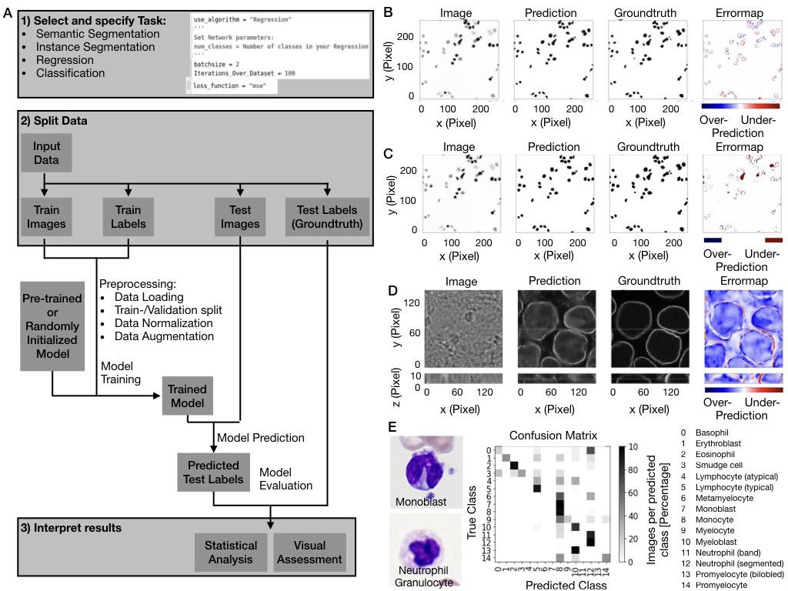

# Deep Learning Pipeline

Our pipeline enables non-experts to use state-of-the art deep learning methods on biomedical image data. In order to reduce potential point of errors in an experimental setup we have highly automated and standardized as well as debugged and tested our pipeline. Without any parameter tuning we have benchmarked it on XX datasets. For customization of the pipeline to specific tasks all code is easily accessibility. 



## Folders

Here you can find the information about the folders in the code:

- [classification](classification)
- [data_generator](data_generator)
- [Preprocessing_Evaluation](Preprocessing_Evaluation)
- [segmentation](segmentation)

## Dependencies

For running the code, you need to have Python 3.7 or higher installed. In addition, these are the main dependencies:

```json
{
   "cudatoolkit":"10.1.243",
   "cudnn":"7.6.5",
   "h5py":"2.9.0",
   "hdf5":"1.10.4",
   "imageio":"2.6.1",
   "keras":"2.2.4",
   "matplotlib":"3.1.1",
   "numpy":"1.16.4",
   "python":"3.6.7",
   "scikit-image":"0.15.0",
   "scikit-learn":"0.21.3",
   "scipy":"1.3.0",
   "tensorboard":"1.14.0",
   "tensorflow":"1.14.0",
   "tensorflow-gpu":"1.14.0"
}
```

## Running Classification

## Running Segmentation

## Running Regression

## TODO

- [x] classifciation
- [ ] making the code modular
- [ ] adding documentation
- [ ] adding example
- [ ] add docker
- [ ] add objects instead of the main functions
- [ ] add tests

