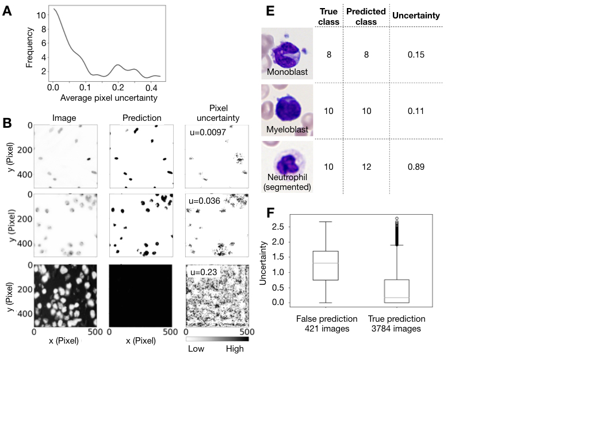

# Deep Learning Pipeline

Our pipeline enables non-experts to use state-of-the art deep learning methods on biomedical image data. In order to reduce potential point of errors in an experimental setup we have highly automated and standardized as well as debugged and tested our pipeline. Without any parameter tuning we have benchmarked it on XX datasets. For customization of the pipeline to specific tasks all code is easily accessibility. 


Figure 1. InstantDL provides an easy to use framework for the analysis of  2D and 3D biomedical images.
(A) Flow diagram of the pipeline with indicated user action. (1) One out of four tasks (semantic segmentation, instance segmentation, regression, classification) is selected by the user. Up to ten parameters can be set in the configuration file to adopt the pipeline to the task. A code snippet illustrates task selection and six of the ten parameter settings in the configuration file:  selected task (use_algorithm), path to folder (path), if pretrained weights should be used the path to these (pretrained_weights_path) should be set, batch size (batchsize) and epochs chosen (Iterations_Over_Dataset). (2) Input data is split into train and test set by putting the data in the corresponding folders. After executing the python configuration file the pipeline will automatically load the data from the train folder, create a 20% test-validation split, normalize and augment the data (see Methods for details). Training is initiated with either a pre-trained model or random weights. After training, the  model predicts segmentation masks, pixel values or labels for the images in the test set. (3) Results can be interpreted by the user via statistical and visual assessment of the predicted outcome that can be compared to the ground truth in the test set.
(B) Example output for a 2D semantic segmentation task. Cell nuclei in a brightfield image (Image) are segmented with a U-Net (Prediction) , and compared to the original annotation (Groundtruth). The Errormap indicates over- and under-predicted pixel. Semantic segmentation predicts a class probability for each pixel. The image is part of the 2018 Kaggle nuclei segmentation challenge dataset [2018 Data Science Bowl] (https://www.kaggle.com/c/data-science-bowl-2018/overview)
(C) Example output for a 2D instance segmentation task of the same image as in in (B). A  binary mask is predicted for each object in the image using the Mask-R-CNN algorithm.
(D) Example output for a 3D regression task. From stacks of bright-field images (Image) of human embryonic kidney cells, human fibrosarcoma cells and genome-edited lines (Ounkomol et al. 2018) the pipeline predicts a nuclear envelope (Prediction) that fits the true staining (Groundtruth). The first row shows the x-y-plane, the bottom row the x-z plane of the 3D volume. Prediction is performed using a U-Net REF.
(E) Example output for a classification task of benign and leukemic blood cells in blood smears from 200 individuals [Matek et al. 2019](https://www.nature.com/articles/s42256-019-0101-9). We show two exemplary microscopy images (left) of a monoblast and a neutrophil. The white blood cell type is predicted with a ResNet50. The confusion matrix (middle) shows that most of the 15 classes can be well predicted, in accordance to [Matek et al. 2019](https://www.nature.com/articles/s42256-019-0101-9).

## Folders

Here you can find the information about the folders in the code:

- [classification](classification)
- [data_generator](data_generator)
- [evaluation](evaluation)
- [examples](examples)
- [metrics](metrics)
- [preprocessing](preprocessing)
- [segmentation](segmentation)

## Dependencies

For running the code, you need to have Python 3.7 or higher installed. In addition, these are the main dependencies:

```json
{
   "cudatoolkit":"10.1.243",
   "cudnn":"7.6.5",
   "h5py":"2.9.0",
   "hdf5":"1.10.4",
   "imageio":"2.6.1",
   "keras":"2.2.4",
   "matplotlib":"3.1.1",
   "numpy":"1.16.4",
   "python":"3.6.7",
   "scikit-image":"0.15.0",
   "scikit-learn":"0.21.3",
   "scipy":"1.3.0",
   "tensorboard":"1.14.0",
   "tensorflow":"1.14.0",
   "tensorflow-gpu":"1.14.0"
}
```

## How to use the code

```bash
The pipeline is based on folders. Please put your data manually in the corresponding folders as illustrated by the figure above. The folder names must not be changed as this will stop the pipeline from functioning.

The config.json file in the config folder must be used to set parameters for the pipeline. After this the pipeline is started by executing the main.py file. Predictins from the testset will be saved after training to the Results folder which will automatically be created. 

From there evaluations using jupyter-notebooks from the Evaluation folder can be used for visual and statistical assessment. Therefore only the path in the jupyter-notebook files has to be adapted. 

Possible setting in the config.json file are: 
"use_algorithm": "Regression", "SemanticSegmentation", "Instance Segmentation" or "Classification"
"path": "data/Ouncomol_NucEnvelope_3Dnew", #Set the path to your project directory here
"use_pretrained_weights": false, # Set to true if you want to use pretrained weights
"pretrained_weights_path": false, # Set a relative file path from your project directory with the filename here. 
"batchsize": 2, # Set the batchsize depeding on your GPU capabilities
"Iterations_Over_Dataset": 200, # Set how many iterations over the dataset should be taken for learning. It might stop automatically if no improvement on the validation set was measured after 25 epochs

Set data augmentation parameters here
"save_augmented_images": false, # true or false
"resample_images": false, # true or false
"std_normalization": false, # true or false
"feature_scaling": false, # true or false
"horizontal_flip": false, # true or false
"vertical_flip": false, # true or false
"poission_noise": false, # false or float 
"rotation_range": false, # false or float (degrees)
"zoom_range": false, # false or float (magnification)
"contrast_range": false, # false or float 
"brightness_range": false, # false or float 
"gamma_shift": false, # false or float (gamma shift parameter)
"threshold_background_image": false, # true or false
"threshold_background_groundtruth": false, # true or false
"gaussian_blur_image": false, # true or float
"gaussian_blur_label": false, # true or  # true or false
"binarize_mask": false # true or false

Set parameters for training here. Number of classes should be 1 for binary segmenation tasks
"loss_function": "mse",
"num_classes": 1, # Number of classes should be 1 for binary segmenation tasks
"Image_size": null, # null or tuple with dimensions of desired image size in format (x-dim, y-dim, [z-dim,] channels)
"calculate_uncertainty": false # true or false


python main.py --config ./config.json


## Run examples:
One example for each task of semantic segmentation, instance segmentation, regression and classification is in the examples folder.

To run them only the corresponding config.json file from the example folder must be copied into the configs folder and renamed to "config.json".

Then the main.py can be executed and the example will run with the provided data. 

Please dont expect to achieve competitive results on these datasets, as they are very small and only for illustration purposes.


## Uncertainty estimation

We have implemented MC Dropout for semantic segmentation, regression and classification. During evaluation on the testset it evaluates 20 different models by using dropout during interference time
and calculate the model uncertainty on the test-set as suggested by [Gal et. al.](https://arxiv.org/abs/1506.02142) and implemented in [this method](https://openreview.net/pdf?id=Sk_P2Q9sG) and [here](https://github.com/RobRomijnders/bayes_nn). The uncertainty is saved as separate numpy files for regression and semantic segmentation tasks and in the .csv file for classification tasks. Figure 2 shows how the uncertainty
estimation for a regression and a classification task works. For regression and semantic segmentation the pipeline saves an uncertainty map to the project folder, in which areas with high uncertainty are visible (Figure 2.B). For classification
the certainty measure is printed to the results file. Numbers close to zero are considered certain, higher numbers uncertain. Uncertainty estimation allows for a new level of interpretability of results.



Figure 2: Uncertainty can be estimated with InstantDL using semantic segmentation, regression and classification. Estimating uncertainty can help to identify images outside of the training distribution, corrupted images or model failures and incorrect predictions. It is a measure of the predictions robustness, adding a new level of insights and interpretability of results.
(A) The distribution of uncertainty scores for each image of a semantic segmentation task [2018 Data Science Bowl] (https://www.kaggle.com/c/data-science-bowl-2018/overview), where nuclei were segmented from images of different organs and imaging modalities. A high uncertainty score indicates a high uncertainty.
Using the uncertainty incorrect predictions can be identified: While in (B) a low uncertainty score indicates a correct prediction.
(C) For a median uncertainty score the prediction seems to fit the input image with regions of ambiguous predictions are indicated by the uncertainty map.
(D) A high average uncertainty can indicate model failures and can help identify incorrect predictions.
(E) For a classification task of white blood cells [Matek et al. 2019](https://www.nature.com/articles/s42256-019-0101-9), uncertainty estimation indicates incorrect predictions.
(E) Statistical assessment of the uncertainty prediction of the blast cell in myeloid leukemia dataset. The distributions of uncertainty values for correct and false predictions differ significantly (pvalue = 3,4*e-82). The significant separation of the two distributions shows that certainty correlates with correct predictions.


## Comparison

| Application | InstantDL | Open ML  | Google Cloud AI  | ImJoy |
| ------ | ------ | ------  | ------  | ------ |
| Host | Local, cluster or in Google-Colab | Web based  | Web based  | Web based |
| Data privacy | Yes | Shared with upload | Yes  | Yes |
| Target audience | Biomedical researchers  | Researchers and Developers  | Enterprises  | Researchers and Developers |
| Developed for  | Biomedical images | All kinds of data  | All kinds of data  | All kinds of data |
| Customizability of Code | Code fully accessible | Code fully accessible  | Code not available  | Possible through writing a plugin |
| Debugged and tested | Yes | Yes  | Yes  | Yes |
| Cost | Free | Free  | Free  | Payment plan |


## TODO

- [x] classifciation
- [ ] making the code modular
- [ ] adding documentation
- [ ] adding example
- [ ] add docker
- [ ] add objects instead of the main functions
- [ ] add tests

